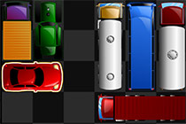

 

  

<h3 align="center">Rushhour</h3>

  

    Eine Implementation des bekannten Spiels "rushhour" für den Informatikunterricht.
     
    <a href="https://github.com/flxwly/rushhour/tree/master/sourcefiles"><strong>Zu den Source files »</strong></a>
     
  

<!-- TABLE OF CONTENTS -->

  
Inhalt

  <ol>
    <li>
      <a href="#about-the-project">Über dieses Projekt</a>
      <ul>
        <li><a href="#built-with">Gebaut mit</a></li>
      </ul>
    </li>
    <li><a href="#getting-started">Das Spiel starten</a></li>
    <li><a href="#usage">Steuerung</a></li>
    <li><a href="#contact">Kontakt</a></li>
    <li><a href="#sources">Quellen</a></li>
  </ol>

<!-- ABOUT THE PROJECT -->

## Über das Projekt

Für den Kurs If26 sollte zum Ende des zweiten Semesters das Spiel Rushhour in Java implementiert werden. Wie sicher zu
sehen ist, habe ich jedoch ausschließlich C++ für das Projekt verwendet. Dies hat folgende Gründe:
C++ besitzt anders als Java Zeiger. Dies ist in diesem Fall sinnvoll, da so Autos als Objekt selbst bestehen können und
das Feld an den Stellen, die sie belegen, nur eine Referenz zu den jeweiligen Autos besitzt. Außerdem mag ich C++
einfach lieber als Java :P.

(<a href="#top">zurück nach oben</a>)

### Gebaut mit

Für die grafische Darstellung wird SFML benutzt. Für mehr Informationen
siehe [SFML Dokumentation](https://www.sfml-dev.org/documentation/2.5.1/). Zum Kompilieren wird MinGW benutzt.

* [SFML](https://www.sfml-dev.org/)
* [MinGW Builds 7.3.0](https://sourceforge.net/projects/mingw-w64/files/Toolchains%20targetting%20Win32/Personal%20Builds/mingw-builds/7.3.0/threads-posix/dwarf/i686-7.3.0-release-posix-dwarf-rt_v5-rev0.7z/download)

(<a href="#top">zurück nach oben</a>)

<!-- GETTING STARTED -->

## Das Spiel starten

Zum Kompilieren wird SFML 2.5.1 und der passende C++ Kompiler benötigt. Beides lässt sich
unter ([link](https://www.sfml-dev.org/download/sfml/2.5.1/))
herunterladen. Um das Spiel nur zu starten, wird lediglich ein Rechner mit Windowsbetriebssystem benötigt. Dazu kann
unter [releases](https://github.com/flxwly/rushhour/releases) die letzte Version als Zip-Datei heruntergeladen werden.
Nun muss diese an einem beliebigen Ort entpackt werden. Als Letztes muss nur noch die rushhour.exe Datei im
"bin" Ordner der entpackten Dateien ausgeführt werden.

<!-- USAGE EXAMPLES -->

## Steuerung

Mit einem Mausklick auf ein Auto wird dieses ausgewählt. Anschließend kann dieses mit den Pfeiltasten in die jeweilige
Richtung bewegt werden. _Dies geht nur, wenn das Auto sich auch wirklich in diese Richtung bewegen kann._ Klickt man auf
den "nochmal" Knopf, so wird das Level neu gestartet. Klickt man auf "<" oder ">", so wird entweder ein Level
zurückgegangen oder das nächste gestartet. Beendet man ein Level startet auch das nächste Level.
_Hinweis: Die Level sind nicht nach Schwierigkeit sortiert!_

(<a href="#top">zurück nach oben</a>)

<!-- CONTACT -->

## Kontakt

Nepomuk Freisfeld - flxwly@gmail.com

Projektlink: [https://github.com/flxwly/rushhour](https://github.com/flxwly/rushhour)

(<a href="#top">zurück nach oben</a>)

<!-- ACKNOWLEDGMENTS -->

## Quellen

* [SFML Dokumentation](https://www.sfml-dev.org/documentation/2.5.1/)
* [C++ Dokumentation](https://en.cppreference.com/w/)
* [Rushhour Brettspiel](https://www.thinkfun.de/products/rush-hour/)
* [CLion IDE](https://www.jetbrains.com/de-de/clion/)
* [RapidJSON](https://rapidjson.org/)

(<a href="#top">zurück nach oben</a>)

<!-- MARKDOWN LINKS & IMAGES -->
<!-- https://www.markdownguide.org/basic-syntax/#reference-style-links -->

[forks-shield]: https://img.shields.io/github/forks/othneildrew/Best-README-Template.svg?style=for-the-badge

[forks-url]: https://github.com/othneildrew/Best-README-Template/network/members

[stars-shield]: https://img.shields.io/github/stars/othneildrew/Best-README-Template.svg?style=for-the-badge

[stars-url]: https://github.com/othneildrew/Best-README-Template/stargazers

[issues-shield]: https://img.shields.io/github/issues/othneildrew/Best-README-Template.svg?style=for-the-badge

[issues-url]: https://github.com/othneildrew/Best-README-Template/issues

[license-shield]: https://img.shields.io/github/license/othneildrew/Best-README-Template.svg?style=for-the-badge

[license-url]: https://github.com/othneildrew/Best-README-Template/blob/master/LICENSE.txt

[linkedin-shield]: https://img.shields.io/badge/-LinkedIn-black.svg?style=for-the-badge&logo=linkedin&colorB=555

[linkedin-url]: https://linkedin.com/in/othneildrew

[product-screenshot]: images/screenshot.png